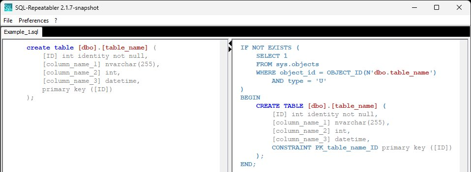
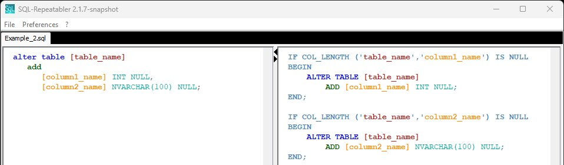
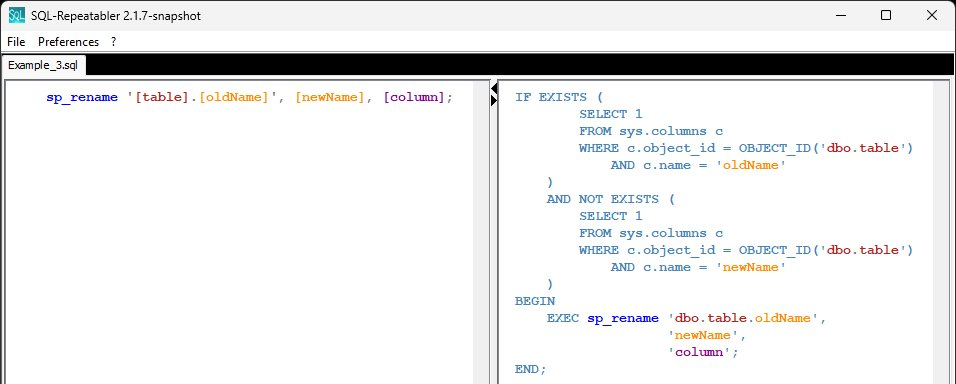

# SQL-Repeatabler

<table>
  <tr>
    <td width="400">
      
    </td>
    <td>
      When working with lo code platform <a href="https://appian.com/">Appian</a>, creating and modifying record types (SQL database tables) generates small SQL scripts containing i.e. 'create table' or 'alter table' statements, needed to deploy the database changes from dev to higher zones.
  Depending on the deployment tool used, the scripts may be executed more than once.
A 'create table' statement will fail when running the second time, because the table already exists.
      </td>
</tr>
</table>

<table>
  <tr>
    <td>
    This is where <b>Sql-Repeatabler</b> comes into play.
  In case of a 'create table' statement, this tool puts an 'if not exists table...' check in front of the statement.
  <u>Limitations:</u>
 <ul>
  <li>This is not a full featured SQL tool, but only covers simple scripts produced by Appian Designer when working with record types. It only will be enhanced as needed.</li>
  <li>This tool expects and generates SQL scripts in Microsoft flavour (T-SQL). It contains only very few corrections in case the source script is MySQL flavoured.</li>
</ul>
</td>
    <td width="300">
      
    </td>
</tr>
</table>

<table>
  <tr>
    <td width="400">
      
    </td>
    <td>
<u>Usage:</u>
 <ol>
  <li>After start, the tool shows one of a few ape related AI generated images. Yes this is part of the core functionality, because the ape is our friendly team mascot ;-)</li>
  <li>Drag´n´drop one or more .sql files on the image</li>
  <li>The tool opens a view with a tab for each file, showing the original script on the left, the converted script on the right side</li>
  <li>Manually check the generated script</li>
  <li>Use file menu 'Save As' to save all generated scripts to one file</li>
</ol> 
</td>
</tr>
</table>

<table>
  <tr>
    <td>
    Tools/resources used to create this Java Swing application:
 <ul>
  
  <li>Java IDE: <a href="https://www.eclipse.org">Eclipse</a></li>
     <li>Icons: <a href="https://fonts.google.com/icons">Google Material Icons</></a></li>
  <li>AI image generation: <a href="https://github.com/comfyanonymous/ComfyUI">ComfyUI</a></li>
  <li>Text2Image model: <a href="https://flux1ai.com/de/dev">FLUX.1 dev</a></li>
  <li>Coding buddy: <a href="https://chatgpt.com">ChatGPT</a></li>
</ul>
</td>
    <td width="400">
      
    </td>
</tr>
</table>

<u>Examples:</u>

CREATE TABLE

------

ALTER TABLE

------

sp_rename

------

INSERT INTO

------
